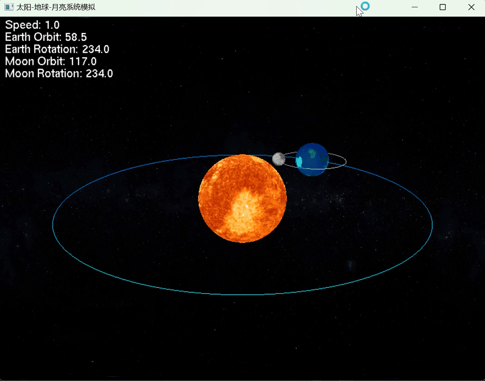

# 太阳—地球—月亮三维动态模拟

本项目使用 C++、OpenGL 和 GLUT 实现了一个交互式太阳—地球—月亮三维动态模拟系统。程序通过球体建模、纹理贴图、光照和坐标变换，展示地球围绕太阳公转和自转，以及月亮围绕地球公转和自转的效果。

用户可以通过键盘调整运行速度，也可以使用鼠标拖动视角，从不同角度观察三维太阳系模型。

## 主要功能

* 绘制太阳、地球和月亮三维球体
* 模拟地球围绕太阳公转
* 模拟地球自转
* 模拟月亮围绕地球公转和自转
* 使用 JPG 图片进行球体纹理贴图
* 使用太空图片渲染星空背景
* 添加环境光、漫反射和高光效果
* 支持鼠标拖动旋转观察视角
* 支持键盘调整动画运行速度
* 实时显示运行速度和天体旋转角度

## 技术实现

### 球体建模与纹理贴图

项目使用 `gluSphere` 绘制太阳、地球和月亮，并通过 `GLUquadricTexture` 生成球面纹理坐标。

使用 `stb_image.h` 加载 JPG 图片，将太阳、地球、月亮和太空背景图片转换为 OpenGL 纹理。

### 天体运动模拟

程序通过 OpenGL 的平移和旋转变换实现天体运动：

* 太阳位于场景中心
* 地球围绕太阳公转并进行自转
* 月亮围绕地球公转并进行自转
* 天体运动角度通过定时器持续更新

### 光照与材质

项目使用 OpenGL 固定管线光照模型，包括：

* 全局环境光
* 漫反射光
* 镜面反射光
* 材质高光参数

通过调整光照强度和材质属性，使球体纹理更加清晰，并增强三维效果。

### 动画更新

程序使用：

```cpp
glutTimerFunc(16, update, 0);
```

定时更新天体角度并重新渲染画面，理论刷新频率约为 60 FPS。

### 交互控制

程序支持键盘和鼠标交互：

* 使用键盘调整动画运行速度
* 按住鼠标左键并拖动，可以旋转观察视角
* 屏幕实时显示当前运行速度和天体角度

## 开发环境

* Windows
* Visual Studio
* C++
* OpenGL
* GLUT / FreeGLUT
* GLU
* stb_image

## 项目结构

```text
solar-system-dynamic-map/
├── conf/                    # 项目配置文件
├── readme_img/              # README 演示图片
├── solar/                   # 项目相关文件
├── earth.jpg                # 地球纹理
├── moon.jpg                 # 月亮纹理
├── sun.jpg                  # 太阳纹理
├── space.jpg                # 太空背景纹理
├── glad.c                   # OpenGL 函数加载相关文件
├── stb_image.h              # 图片加载库
├── solar.cpp                # 主要程序源代码
├── solar.sln                # Visual Studio 解决方案
├── solar.vcxproj            # Visual Studio 项目配置
├── solar.vcxproj.filters    # Visual Studio 文件分类配置
├── packages.config          # NuGet 依赖配置
├── README.md                # 项目说明
└── LICENSE                  # 项目许可证
```

`.vs`、`x64`、`packages` 和 `solar.vcxproj.user` 等本地配置及编译文件不需要上传到 GitHub。

## 核心程序模块

* `LoadTextureWithSTB`：加载图片并创建 OpenGL 纹理
* `drawTexturedSphere`：绘制带纹理的三维球体
* `display`：绘制太阳、地球、月亮、轨道和背景
* `update`：更新天体旋转角度和动画状态
* `keyboard`：处理键盘输入
* `mouseButton`：处理鼠标按键操作
* `mouseMotion`：处理鼠标拖动和视角旋转
* `main`：初始化窗口、配置 OpenGL 并启动主循环

## 运行方法

### 1. 打开项目

使用 Visual Studio 打开：

```text
solar.sln
```

### 2. 恢复依赖

如果 Visual Studio 提示缺少 NuGet 软件包，请右键解决方案，选择：

```text
还原 NuGet 程序包
```

也可以在 Visual Studio 中重新生成解决方案，让系统自动恢复 `packages.config` 中声明的依赖。

### 3. 选择运行平台

在 Visual Studio 顶部工具栏中选择：

```text
Debug | x64
```

如果项目配置使用其他平台，请根据实际情况选择对应的平台。

### 4. 编译项目

选择：

```text
生成 → 生成解决方案
```

也可以使用快捷键：

```text
Ctrl + Shift + B
```

### 5. 运行程序

点击 Visual Studio 顶部的“本地 Windows 调试器”，或者按：

```text
F5
```

如果只运行程序而不进入调试模式，可以按：

```text
Ctrl + F5
```

## 操作说明

| 操作       | 功能       |
| -------- | -------- |
| `F` 键    | 加快天体运行速度 |
| `S` 键    | 降低天体运行速度 |
| 按住鼠标左键拖动 | 旋转观察视角   |

## 运行效果

<p align="center">
  
</p>

## 后续改进

* 添加更加真实的动态阴影
* 引入真实时间同步机制
* 优化天体尺寸和轨道比例
* 增加更多太阳系行星
* 添加缩放和平移视角控制
* 使用现代 OpenGL 和 Shader 重构渲染流程
* 增加轨道开关、暂停和重置功能

## 项目总结

本项目综合运用了 OpenGL 三维建模、坐标变换、纹理贴图、光照、材质和交互控制等知识，实现了一个具有动态效果和基本交互能力的太阳系模拟程序。

通过项目实践，可以进一步理解三维场景中自转、公转和层级坐标变换之间的关系，并掌握 OpenGL 纹理加载、光照参数配置和动画更新的基本方法。

## 致谢与来源

本项目基于 bytesc 发布的开源项目进行学习和修改，主要完成了太阳、地球与月亮的运动模拟、纹理贴图、光照效果及交互控制等内容。

原项目及相关代码遵循 MIT License，版权声明详见 [LICENSE](LICENSE)。。
